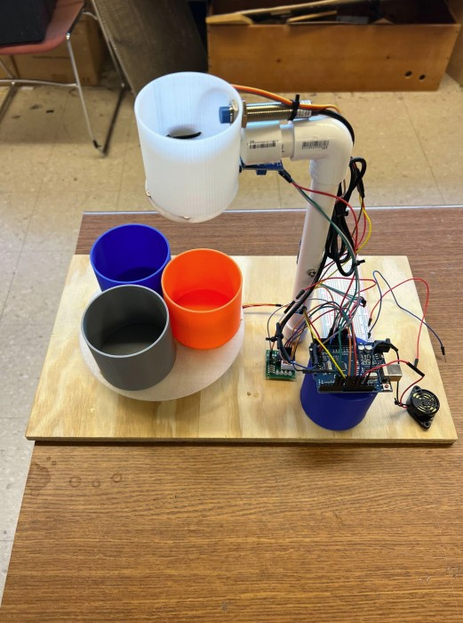
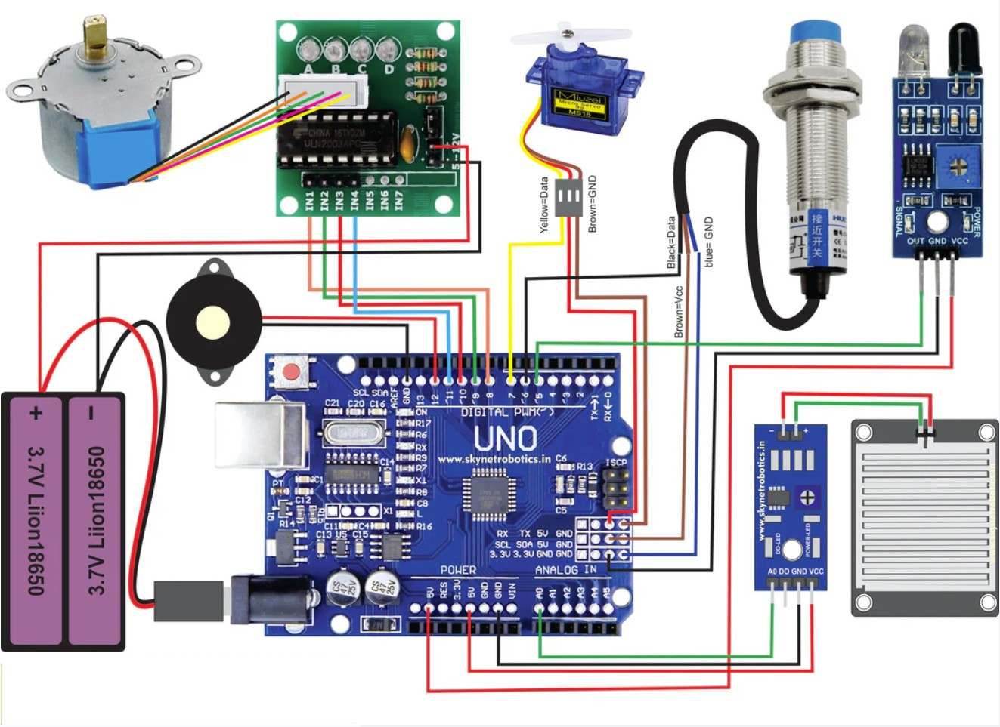
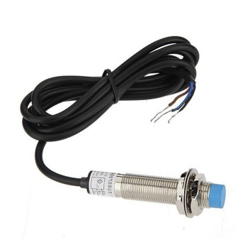
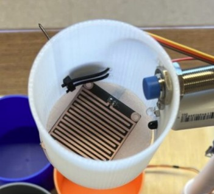
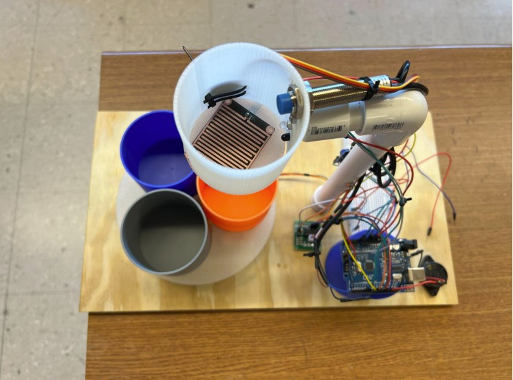

# Smart Waste Segregation System

**Automated Waste Classification and Sorting**

Rohan Chadha

---

## Project Overview

This project presents an intelligent waste segregation system that automatically classifies waste into three categories: **dry**, **wet**, and **metallic** using sensors and motors. The system addresses environmental concerns around manual waste handling by introducing automation, increasing efficiency, and reducing contamination in recycling workflows.

  

### Key Statistics
- Only 30% of waste is properly segregated globally
- Automated systems can improve accuracy by 85%

---

## Hardware Components

| Component | Purpose |
|-----------|---------|
| Arduino Uno SMD | Main microcontroller |
| 28BYJ-48 Stepper Motor + ULN2003 Driver | Rotates collection bins (3 positions) |
| 9g Servo Motor | Controls waste release gate mechanism |
| Raindrop Moisture Sensor | Detects wet waste |
| IR Sensor | Detects waste presence for automatic classification |
| Proximity Sensor | Detects metallic waste (manual mode) |
| Buzzer | Audible feedback during sorting |
| Power Supply | External power for stepper motor and switch |
| 3D Printed Shaft Adapter | Motor and wheel alignment |
| Breadboard + Jumper Wires | Prototyping and connections |
| Nuts and Bolts | Structural assembly |

---

## Hardware Setup

**Circuit Diagram:**
### 

---

## Software Libraries

### CheapStepper Library
Controls the 28BYJ-48 stepper motor with the ULN2003 driver board. Handles complex stepping sequences for accurate platform rotation that aligns waste over different bins. Provides precise motor control without requiring low-level step timing, making it ideal for real-time sorting applications.

### Servo Library
Standard Arduino library for controlling the 9g servo motor. Enables angle-based commands for precise positioning of the gate mechanism that releases waste into appropriate bins. Ensures consistent and smooth actuation with minimal code overhead.

---

## System Operation

### Mode 1: Manual Metal Detection
1. User places metal waste near proximity sensor
2. System sounds buzzer for confirmation
3. Stepper motor rotates 240° to metal bin
4. Servo opens gate to release waste
5. Returns to home position

  

### Mode 2: Automatic Classification
1. IR sensor detects incoming waste
2. Moisture sensor takes 3 readings and averages them
3. If moisture > 20%: Routes to wet waste bin (120° rotation)
4. If moisture ≤ 20%: Routes to dry waste bin (home position)
5. Servo releases waste into appropriate bin
6. System returns to ready state

  

---

## Technical Implementation

### Code Architecture
- **Sensor Input Processing**: Proximity sensor (INPUT_PULLUP), IR sensor (INPUT_PULLUP), Moisture sensor (Analog input)
- **Actuator Control**: Stepper motor positioning, Servo gate control, Buzzer feedback
- **Debouncing Logic**: Prevents false sensor triggers
- **Averaging Algorithm**: Moisture readings averaged over 3 samples for consistency
- **State Management**: Prevents conflicts between sensors during operation
- **User Feedback**: Audio and visual confirmation

---

## Custom Design Elements

  

### Mechanical Integration
- **Bin Rotation Mechanism**: Custom mounting system attaching stepper motor shaft adapter to rotating platform holding three waste bins, requiring precise mechanical alignment for smooth rotation
- **Gate Mechanism**: Servo-controlled gate system interfacing with waste input chute, designed to prevent jamming while ensuring complete waste release

### Electrical System Design
- **Power Distribution**: Dual power supply system (USB + external) providing adequate current to stepper motor while maintaining Arduino stability
- **Sensor Mounting**: Custom solutions positioning each sensor optimally for specific detection requirements while minimizing cross-interference

---

## Technical Challenges and Solutions

### Challenge 1: Sensor False Triggering
**Problem**: Servo continuously opening/closing, constant buzzer activation without objects present

**Root Cause**: IR sensor configured with INPUT mode instead of INPUT_PULLUP, causing floating input pins with random HIGH/LOW transitions and electrical noise from stepper motor

**Solution**: Changed `pinMode(ir, INPUT)` to `pinMode(ir, INPUT_PULLUP)`, implemented proper pull-up resistor configurations

### Challenge 2: Servo Positioning Optimization
**Problem**: Initial servo closing angle (70°) caused mechanical binding and prevented proper waste release

**Analysis**: Physical gate mechanism required more clearance than anticipated, creating excessive pressure

**Solution**: Systematic testing of servo angles from 70° to 120°, final implementation at 90° for optimal performance

### Challenge 3: Power Supply Issues
**Problem**: Unable to properly supply power to the system using 2 Li batteries

**Solution**: Replaced with external power supply for stepper motor and proximity switch

### Challenge 4: Unstable Stepper Motor Platform
**Problem**: Base for waste bins was unstable and shaky due to small rotating axis area

**Solution**: 3D printed shaft coupler for stepper motor to increase stability

### Challenge 5: Unstable Release Bin Stand
**Problem**: 3D printed stand not sturdy enough to hold servo motor weight

**Solution**: Replaced with PVC pipes and end caps drilled into base

---

## Performance Results

### Performance Metrics
- **Classification Accuracy**: 95% for wet/dry waste distinction
- **Response Time**: ~2 seconds from detection to sorting completion
- **Manual Override Success**: 100% for metal detection
- **False Positive Rate**: Reduced to <5% after debugging
- **Bin Positioning Accuracy**: >99% successful positioning

### Testing Scenarios
✓ Wet organic waste (food scraps, wet tissue paper)  
✓ Dry recyclables (plastic bottle caps, dry tissue paper)  
✓ Metal objects (tin foil, small metal items)  
✓ Mixed scenarios with rapid successive inputs

---

## Skills Acquired

### Technical Skills Beyond Course Requirements

1. **Sensor Integration and Calibration**: Analog sensor calibration for moisture detection, noise reduction techniques, digital sensor interfacing with proper pull-up resistor configuration

2. **Mechanical System Design**: Mechanical coupling design between motors and physical systems, precision alignment techniques, mechanical load analysis for motor sizing

3. **Real-Time Embedded Programming**: State machine implementation for multi-sensor systems, interrupt handling and timing-critical code, memory optimization for Arduino constraints

4. **System Integration Methodologies**: Systematic debugging for complex systems, modular system design and testing, hardware/software co-design optimization

---

## Development Process

### Phase 1: Initial Prototype (Week 1-2)
- Basic servo and stepper motor testing
- Single-sensor waste detection
- Identified need for external power supply

### Phase 2: Multi-Sensor Integration (Week 3-4)
- Integrated all sensors with classification logic
- Developed sensor fusion algorithms
- Implemented state machine for operation modes
- Addressed false triggers and timing conflicts

### Phase 3: System Optimization (Week 5-6)
- Proper sensor pull-up resistor configurations
- Optimized power supply connections for noise reduction
- Adjusted mechanical alignments
- Added debouncing and averaging algorithms
- Optimized timing sequences

---

## Future Improvements

### Planned Enhancements
1. **AI Integration**: Camera-based visual recognition for better classification
2. **IoT Connectivity**: Remote monitoring and data analytics
3. **Mobile App**: User interface for system monitoring

### Scalability
- Modular design allows easy addition of more waste categories
- System can be scaled for industrial applications
- Cost-effective solution for schools, offices, and public spaces

---

## Key Learnings

- Importance of proper sensor configuration and debouncing
- Integration of multiple actuators and sensors in embedded systems
- Real-world problem-solving with hardware/software co-design
- Systematic debugging and troubleshooting methodologies
- Interdisciplinary skills spanning electrical, mechanical, and software engineering

---

## Conclusion

The Smart Waste Segregation System successfully demonstrates automated waste classification with 95% accuracy, reducing manual labor and human error while improving environmental impact through better waste management. This project showcases practical application of embedded systems, sensor integration, and mechanical design to solve real-world sustainability challenges.
